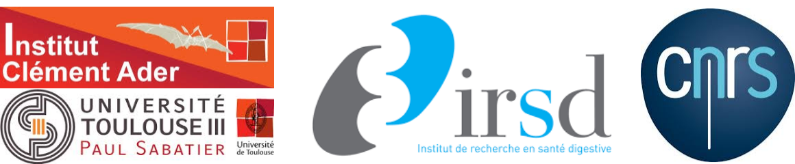

title: Offre de stage
slug: stage
date: 15-11-2017
tags: jobs
summary: We're looking for a master student to come train with us

# Offre de stage: Identification des paramètres optimaux d’un modèle d’organisation multicellulaire.

## Contexte

Fruit d’une collaboration entre l’Institut Clément Ader (ICA) et
l'Institut de Recherche en Santé Digestive (IRSD), le projet MOCCAssIN
(Modelisation of epithelio-stromal alterations in colorectal cancer
initiation) financé par le plan Cancer 2014-2019, a pour but
d’identifier les caractéristiques spécifiques des cellules
épithéliales afin d’améliorer les dépistages lors de la phase
d'analyse des cultures.

## Objectif et travail attendu

Un modèle existant (la bibliothèque
[`tyssue`](https://github.com/damcb/tyssue) ) permet de décrire
l'organisation multicellulaire ainsi que la dynamique d’interaction
entre les cellules, de migration et de différenciation des cellules
épithéliales. Ce modèle est décrit à l’aide d’un maillage d’éléments
finis dont le comportement mécanique dépend de paramètres tels que
l'élasticité de la membrane cellulaire ou la contractilité du
cytosquelette. Ce jeu de paramètres est identifié via la minimisation
d’une fonction d’énergie dépendant de la géométrie du tissu
considéré. Un des enjeux du projet MOCCAssIN consiste à :

* extraire de nouvelles informations géométriques à l’aide de méthodes d’analyse
d’image 2D ou 3D.
* enrichir la fonction coût à l’aide de ces nouvelles données afin de
prendre en compte le recalage géométrique de l’organoïde sur les
échantillons observés.
* minimiser la nouvelle fonction coût afin d’obtenir des paramètres
optimaux qui permettent à l'organoïde simulé d’évoluer de manière
prédictive.

Le stage, situé dans la phase préliminaire du projet,
consiste à étudier les différentes informations 2D et 3D qu’il est
possible d’extraire (à l’aide de méthode de traitement d’image
standard) des données fournies par l’IRSD. **Ce projet constitue une
pré-étude d’une thèse CIFRE qui poursuivra ce stage et débutera
fin 2018.**

## Profil

Cette offre s’adresse à des étudiants en M2 ou Ecole d’ingénieurs en Mathématiques Appliquées et/ou
Mécanique Numérique et/ou Traitement d’Images motivés par la poursuite d’étude en thèse.

Les compétences attendues sont :

* maîtrise des bases en traitement d’images
* maîtrise des bases d’optimisation numérique.
* Notion sur la méthode par Eléments Finis

Le langage de programmation est Python.

* Laboratoire d’accueil :
> ICA CNRS UMR 5312 / Université Paul Sabatier (poste basé à Toulouse)
* Durée :
> 6 mois à compter du premier trimestre 2018
* Gratification
> 550 € / mois environ

## Contact

Merci d’adresser par email 1 CV et 1 LM aux 5 personnes suivantes:

- **Florian BUGARIN** -- florian.bugarin@univ-tlse3
- **Stephane SEGONDS** -- stephane.segonds@univ-tlse3.fr
- **Audrey Ferrand** -- audrey.ferrand@inserm.fr
- **Frederick Barreau** -- frederick.barreau@inserm.com
- **Guillaume GAY** -- guillaume@damcb.com
